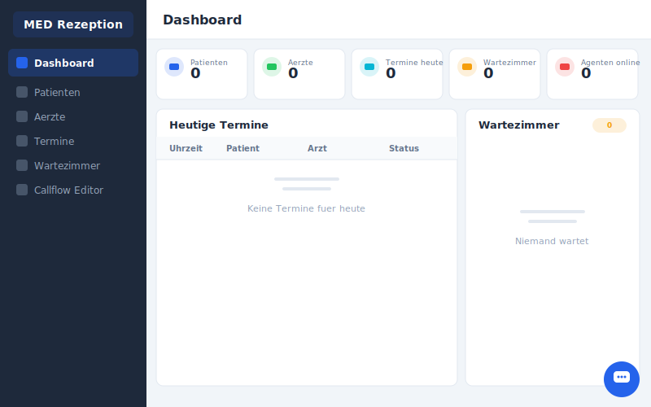
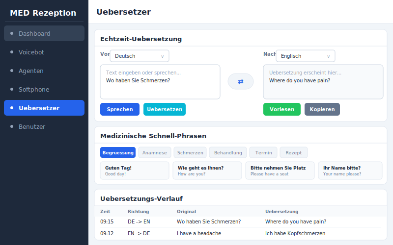
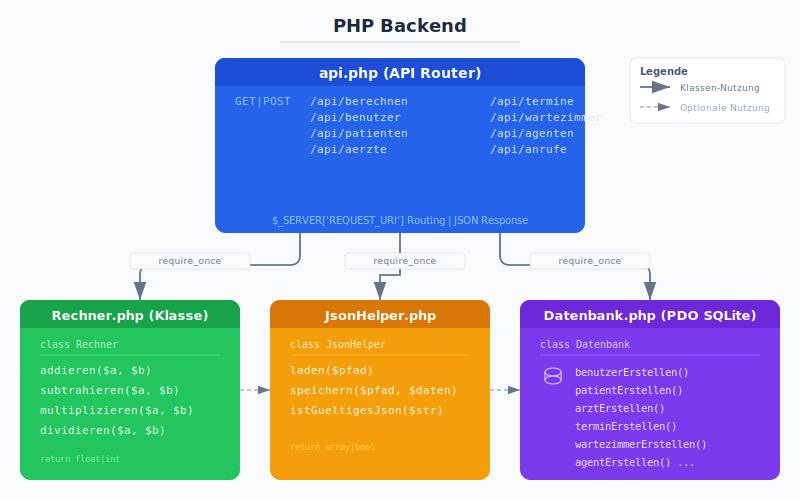

# MED Rezeption - Praxisverwaltung

Medizinische Praxisverwaltung mit Voicebot, Callflow-Editor, Softphone und Echtzeit-Uebersetzer.

## Frontend-Seiten

### Dashboard


### Patienten


### Aerzte


### Termine


### Wartezimmer


### Callflow Editor


### Voicebot


### Agenten & Telefonie


### Softphone


### Uebersetzer


### Benutzer & Rechner


## Backend-Architektur

### Python Backend (Flask)


### PHP Backend


### Asterisk Voicebot (AGI)


## Tech-Stack

| Bereich | Technologie |
|---------|-------------|
| Frontend | HTML5, CSS3, JavaScript (Vanilla) |
| Backend | Python (Flask), PHP 8.2 |
| Datenbank | SQLite (WAL-Modus) |
| Telefonie | Asterisk (AGI), SIP/WebRTC |
| Tests | pytest, PHPUnit, Node.js |
| CI/CD | GitHub Actions |

## Projektstruktur

```
src/
  html/          Frontend (11 Seiten + CSS + JS)
  python/        Python-Backend (Flask API + SQLite)
  php/           PHP-Backend (API + PDO)
  json/schemas/  JSON-Schemas fuer Validierung
asterisk/        Voicebot AGI-Script
tests/           Python-, PHP- und HTML-Tests
docs/screenshots/ Vorschaubilder
```

## Starten

```bash
# Python-Backend
pip install flask
python -m src.python.app

# PHP-Backend
php -S localhost:8080 src/php/api.php

# Tests
python -m pytest tests/ -v
vendor/bin/phpunit tests/php/
```
